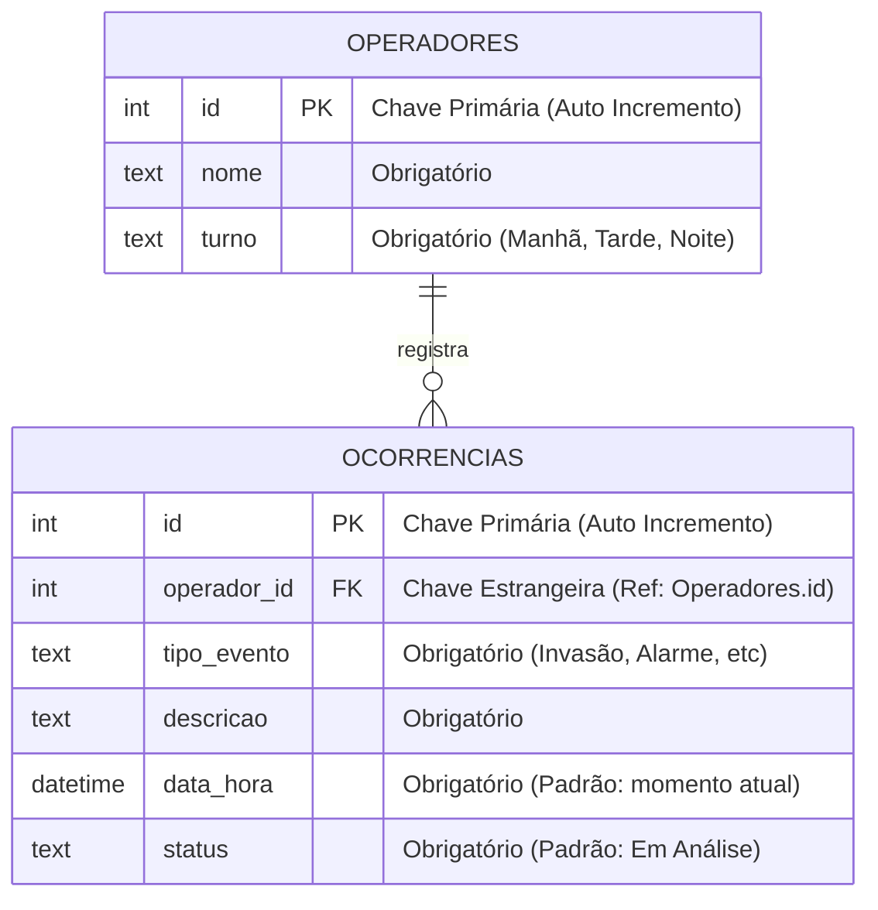

# 📹 MoniLog: Registro de Ocorrências Offline-First

Um aplicativo voltado para o registro ágil de eventos em centrais de videomonitoramento, desenvolvido em **Flutter** com persistência local utilizando **Drift (SQLite)**. O projeto garante que o operador nunca perca anotações de eventos críticos, mesmo durante instabilidades no sistema principal.

---

## 🏛️ Arquitetura do Sistema

O projeto utiliza o **Repository Pattern**, separando o aplicativo em três camadas principais:

1.  **UI (Widgets/Screens)**: Camada visual responsável apenas por exibir dados e capturar interações do usuário (como os formulários de registro e os *cards* de listagem). Não possui lógica de negócio.
2.  **Repository (Negócio)**: Camada intermediária que contém as regras do sistema (validação de campos vazios, formatação de status). Ela orquestra os dados antes de enviá-los ao banco.
3.  **Database/DAO (Persistência)**: Responsável pela comunicação direta com o SQLite via Drift. Executa operações puras de leitura, inserção, atualização e exclusão (CRUD).

---

## 🗄️ Estrutura do Banco de Dados (Schema)

O banco de dados é simples e otimizado, focado em duas tabelas principais com integridade referencial:

---

## 🚀 Como Executar o Projeto (Passo a Passo)

Siga estas etapas para rodar o projeto em sua máquina:

### 1. Pré-requisitos
- Ter o **Flutter SDK** instalado.
- Ter o ambiente de desenvolvimento configurado (recomendado: VS Code ou Android Studio).

### 2. Instalar Dependências
No terminal do projeto, execute para baixar todos os pacotes necessários (como o Drift e o SQLite):

    flutter pub get

### 3. Gerar Código do Banco de Dados
O Drift utiliza geração de código para criar o banco de dados e conectar as tabelas. Sempre que baixar o projeto ou fizer alguma alteração no arquivo `database.dart`, rode:

    dart run build_runner build --delete-conflicting-outputs

### 4. Rodar o Aplicativo

**Para emuladores Android ou ambiente Desktop (Windows/Linux):**

    flutter run

**Para rodar no Web (Chrome) mantendo os dados salvos:**
Para evitar que o Flutter apague o banco de dados SQLite ao fechar o navegador, utilize uma sessão com diretório fixo:

    flutter run -d chrome --web-port=5555 --web-browser-flag="--user-data-dir=/tmp/monilog_chrome"

*Dica: Ao rodar dessa forma, seus registros de testes continuarão lá na próxima vez que você abrir o app.*

---

## 🛠️ Comandos Principais

| Comando | Função |
|---|---|
| `flutter pub get` | Baixa as bibliotecas do projeto descritas no `pubspec.yaml`. |
| `dart run build_runner build` | Atualiza a estrutura do banco de dados após mudanças no código. |
| `dart run build_runner watch` | Fica observando mudanças e gera código do Drift automaticamente. |
| `flutter analyze` | Verifica se há erros ou avisos de boas práticas no código Dart. |

---

## ✨ Funcionalidades Principais
- ✅ **Registro Rápido**: Criação de novas ocorrências com poucos toques, ideal para a agilidade exigida no monitoramento.
- ✅ **Funcionamento Offline-First**: O banco de dados local garante o funcionamento 100% sem internet.
- ✅ **Gestão de Status**: Atualização do progresso das ocorrências (ex: de "Aberto" para "Resolvido").
- ✅ **Vínculo de Responsabilidade**: Rastreabilidade garantida vinculando cada ocorrência ao `id` do operador em turno.
