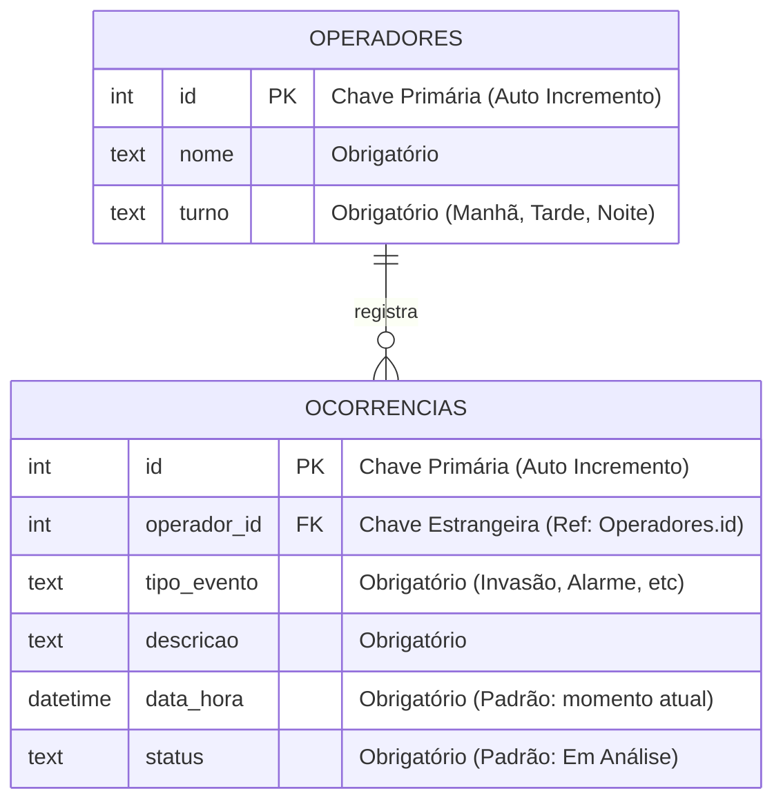

# Diagrama ER - Sistema MoniLog

Abaixo está o diagrama Entidade-Relacionamento (ER) do sistema. O banco de dados possui **2 tabelas principais** conectadas por um relacionamento de `1:N` (Um-para-Muitos).

---

## 📖 Dicionário de Dados (Para você explicar)

### 1. Entidade: `OPERADORES`
Armazena quem está usando o sistema. 
- **Regra de Negócio:** Sempre que alguém entra no sistema, nós validamos se a pessoa já existe pelo nome e turno. Se não existir, o sistema cadastra o operador automaticamente.
- **Campos:**
  - `id`: O identificador único numérico.
  - `nome`: O nome digitado pelo operador.
  - `turno`: O turno de trabalho selecionado.

### 2. Entidade: `OCORRENCIAS`
Armazena os eventos de segurança capturados no monitoramento.
- **Regra de Negócio:** Cada ocorrência **obrigatoriamente** tem que estar vinculada ao operador que a registrou (através do campo `operador_id`). O status sempre nasce como "Em Análise" e pode ser alterado para "Resolvido".
- **Campos:**
  - `id`: Identificador único da ocorrência.
  - `operador_id`: A chave que liga a ocorrência à tabela de operadores.
  - `tipo_evento`: Categoria fixa (Disparo de Alarme, Invasão, etc).
  - `descricao`: O relato em texto digitado pelo operador.
  - `data_hora`: O momento exato que a ocorrência aconteceu.
  - `status`: O controle de resolução do problema.

### 3. O Relacionamento (`1:N`)
- **Lê-se:** "Um Operador pode registrar Várias (N) Ocorrências, mas uma Ocorrência pertence a apenas Um Operador."
- **Por que isso é bom?** Na visão de gestão, é possível puxar um relatório futuro do tipo: *"Me mostre todas as ocorrências de 'Invasão' registradas pelo operador 'Bruno' no turno da 'Noite'."*
